<div align="center">

# 🚗 TelematicsPro

### **Production-Grade Vehicle Telematics Pipeline & Analytics Dashboard**

Transform raw, heterogeneous IoT and OBD-II vehicle telemetry into standardized, cleaned, and production-ready analytical datasets.

[](https://telematicspro.streamlit.app/)

<br/>

[](https://telematicspro.streamlit.app/)
[](https://github.com/AmanYdv77/telematics_pro/actions/workflows/ci.yml)
[](https://www.python.org/)
[](LICENSE)
[](tests/)

<br/>

[🌟 Key Features](#-key-features) •
[🔄 6-Stage Pipeline](#-interactive-6-stage-pipeline) •
[📊 Telematics Taxonomy](#-standard-telematics-taxonomy-40-features) •
[🚀 Quick Start](#-quick-start) •
[⚡ Performance](#-performance-benchmarks) •
[📄 License](#-license)

---

</div>

## 🌟 Key Features

- **⚡ End-to-End Visual Workflow:** Complete 6-stage interactive pipeline built on Streamlit & Plotly.
- **🧠 Intelligent Feature Mapping:** Auto-detects and suggests standard aliases across 40+ telematics and OBD-II fields using fuzzy heuristics.
- **🧩 Complex Vector Parsing:** Effortlessly unpacks nested JSON objects, delimited strings, and 3-axis accelerometer vectors (`accel_x`, `accel_y`, `accel_z`).
- **📍 Geospatial & Kinematic Engine:** Automatic trip segmentation based on temporal delta cutoffs, computing Haversine distance, idle durations, and harsh driving incidents.
- **🛡️ Dynamic Quality Cleaning:** Impute missing values (mean, median, mode, forward/backward fill) and handle statistical anomalies using IQR and Z-Score outlier filtering.
- **📋 Automated Audit Trail:** Generates a structured JSON processing report documenting transformation steps alongside the cleaned CSV export.

---

## 🔄 Interactive 6-Stage Pipeline

```mermaid
flowchart LR
    A["📁 1. Upload & Inspect"] --> B["🔗 2. Map & Parse"]
    B --> C["⚙️ 3. Segment & Extract"]
    C --> D["🧹 4. Clean & Impute"]
    D --> E["📊 5. Analyze & Plot"]
    E --> F["💾 6. Export & Audit"]

    style A fill:#EEF2FF,stroke:#4F46E5,stroke-width:2px
    style B fill:#ECFDF5,stroke:#10B981,stroke-width:2px
    style C fill:#FEF3C7,stroke:#F59E0B,stroke-width:2px
    style D fill:#FEE2E2,stroke:#EF4444,stroke-width:2px
    style E fill:#F3E8FF,stroke:#9333EA,stroke-width:2px
    style F fill:#E0F2FE,stroke:#0284C7,stroke-width:2px
```



<details open>
<summary><b>🔍 Click to Expand Stage-by-Stage Details</b></summary>
<br/>

### 📁 Stage 1: Upload & Inspect
- **CSV Data Ingestion:** Fast drag-and-drop file uploader with built-in instant sample data generation (7,000+ realistic rows).
- **Data Profiling:** Real-time metrics on rows, columns, memory footprint, and duplicate detection.
- **Column Quality Cards:** Visual histograms, missing value percentages, and cardinality detection for every column.

### 🔗 Stage 2: Map & Parse
- **Standardized Mapping:** Match proprietary telemetry headers (e.g. `veh_spd`, `engineRPM`, `lat`) to the 40 standard automotive features.
- **Composite Field Extraction:** Deconstruct composite strings such as 3-axis accelerometer readings (`"0.02,-0.98,0.15"`), JSON payloads, or pipe/comma delimited logs.

### ⚙️ Stage 3: Segment & Extract
- **Temporal Trip Splitting:** Automatic trip partitioning using customizable time gaps (e.g., ignition off > 300s) or existing `trip_id` identifiers.
- **Kinematic Feature Derivation:** Computes cumulative Haversine distance (km), trip duration, idle time vs running time, average speeds, and max speeds.
- **Driving Event Detection:** Identifies harsh braking and rapid acceleration events based on G-force thresholds.

### 🧹 Stage 4: Clean & Impute
- **Missing Data Strategies:** Choose between `Mean`, `Median`, `Mode`, `Forward Fill`, `Zero`, or `Drop Rows`.
- **Outlier Mitigation:** Apply Interquartile Range (IQR) capping or Z-Score threshold filtering to remove sensor spikes.
- **Live Diff Preview:** Inspect side-by-side distributions before and after data cleaning.

### 📊 Stage 5: Analyze & Plot
- **Interactive Visual Explorer:** Dynamic Plotly line charts, scatter correlations, and histogram distributions.
- **Correlation Heatmap:** Interactive correlation matrix across engine RPM, speed, throttle position, and fuel usage.
- **Trip Statistics:** Per-trip breakdown with duration, distance, and safety event counts.

### 💾 Stage 6: Export & Audit
- **Standardized Dataset:** Download cleaned, standardized CSV ready for machine learning models or fleet dashboards.
- **Reproducible Audit Report:** Download a complete JSON specification of all applied cleaning rules, mappings, and segmentations.

</details>

---

## 📊 Standard Telematics Taxonomy (40 Features)

TelematicsPro maps raw data against a comprehensive automotive ontology:

| Category | Standard Features | Description |
|---|---|---|
| **Identity & Spatial** | `vehicle_id`, `trip_id`, `timestamp`, `latitude`, `longitude`, `altitude`, `heading` | Vehicle identification and geospatial positioning |
| **GPS & Motion** | `gps_speed`, `satellites`, `hdop`, `vehicle_speed`, `odometer` | Kinematics, tracking accuracy, and distance |
| **Powertrain & OBD-II** | `engine_rpm`, `throttle_position`, `engine_load`, `manifold_pressure`, `mass_air_flow` | Engine performance and air intake dynamics |
| **Thermals & Fluid** | `coolant_temp`, `intake_air_temp`, `transmission_temp`, `ambient_temp`, `fuel_level`, `instant_fuel_rate` | Temperatures, fuel consumption, and fluid levels |
| **Electrical & Diagnostics** | `battery_voltage`, `dtc_code`, `mil_status` | Electrical stability and Diagnostic Trouble Codes |
| **IMU & Driving Events** | `accel_x`, `accel_y`, `accel_z`, `harsh_brake_flag`, `harsh_accel_flag`, `steering_angle` | 3-axis accelerometer forces and aggressive driving incidents |

---

## 🚀 Quick Start

### 1. Online Demo (No Installation Required)
Access the live deployed application instantly:
👉 **[telematicspro.streamlit.app](https://telematicspro.streamlit.app/)**

### 2. Local Setup

```bash
# 1. Clone the repository
git clone https://github.com/AmanYdv77/telematics_pro.git
cd telematics_pro

# 2. Create and activate a virtual environment
python -m venv .venv
# On Windows:
.venv\Scripts\activate
# On macOS / Linux:
source .venv/bin/activate

# 3. Install dependencies
pip install -r requirements.txt

# 4. Launch the application
streamlit run app.py
```

### 3. Run Automated Tests
```bash
python -m unittest discover -s tests -v
```

---

## ⚡ Performance Benchmarks

| File Size | Record Count | Processing Time | Optimization Tip |
|:---:|:---:|:---:|---|
| **`< 50 MB`** | `< 250,000 rows` | ⚡ **< 3s** | Full statistical profiling enabled |
| **`50 - 100 MB`** | `250k - 500k rows` | 🚀 **~ 5-10s** | Recommended optimal batch size |
| **`100 - 200 MB`** | `500k - 1M rows` | ⏳ **~ 15-30s** | Disable heavy correlation plots for speed |
| **`> 200 MB`** | `> 1,000,000 rows` | ⚠️ **Downsample** | Use date/trip range sampling prior to upload |

---

## 🛠️ Project Structure

```text
telematics_pro/
├── .github/
│   └── workflows/
│       └── ci.yml            # Automated CI syntax and unit test workflow
├── src/
│   ├── constants.py          # 40 standard features, aliases, and thresholds
│   ├── engine.py             # Math, segmentation, and cleaning algorithms
│   ├── sample_data.py        # Realistic multi-trip data generator
│   └── utils.py              # Visual styling and UI helper routines
├── tests/
│   └── test_engine.py        # Automated test suite (haversine, mapping, segmentation)
├── app.py                    # Main Streamlit web application
├── requirements.txt          # Production dependencies
├── setup.bat / setup.sh      # Automated installation scripts
├── run.bat / run.sh          # One-click execution scripts
├── LICENSE                   # MIT License
└── README.md                 # Interactive documentation
```

---

## 👤 Author

**Aman Yadav**
- GitHub: [@AmanYdv77](https://github.com/AmanYdv77)
- Live App: [TelematicsPro](https://telematicspro.streamlit.app/)

---

## 📄 License

This project is licensed under the **MIT License** — see the [LICENSE](LICENSE) file for full details.
