<div align="center">

# TelematicsPro

**Production-Grade Vehicle Telematics Pipeline and Analytics Platform**

Transform raw, heterogeneous IoT and OBD-II vehicle telemetry into standardized, cleaned, and production-ready analytical datasets.

[](https://telematicspro.streamlit.app/)

<br/>

[](https://telematicspro.streamlit.app/)
[](https://github.com/AmanYdv77/telematics_pro/actions/workflows/ci.yml)
[](https://www.python.org/)
[](LICENSE)
[](tests/)

<br/>

[Key Capabilities](#key-capabilities) &bull;
[Processing Pipeline](#processing-pipeline) &bull;
[Telematics Taxonomy](#telematics-taxonomy) &bull;
[Quick Start](#quick-start) &bull;
[Performance](#performance-benchmarks) &bull;
[License](#license)

---

</div>

## Key Capabilities

> **TelematicsPro** is an end-to-end data processing framework designed to bridge the gap between unstructured automotive telemetry streams and reliable machine learning / fleet analytics inputs.

* **Automated Feature Mapping:** Uses fuzzy pattern matching against 40+ standard telematics and OBD-II features to harmonize disparate naming schemes.
* **Complex Payload Parsing:** Decouples composite fields, including 3-axis accelerometer vectors (`accel_x`, `accel_y`, `accel_z`), serialized JSON objects, and delimited text logs.
* **Geospatial & Kinematic Derivation:** Implements temporal trip segmentation, Haversine trajectory distance calculation, idle duration tracking, and threshold-based driving event detection (harsh braking and rapid acceleration).
* **Statistical Cleaning Engine:** Offers configurable strategies for missing data imputation (mean, median, mode, forward fill) and statistical outlier treatment using Interquartile Range (IQR) and Z-score methods.
* **Auditability & Traceability:** Exports cleaned datasets alongside a reproducible JSON audit log recording every transformation applied to the dataset.

---

## Processing Pipeline

```mermaid
flowchart LR
    A["1. Ingest & Profile"] --> B["2. Standardize & Parse"]
    B --> C["3. Segment & Extract"]
    C --> D["4. Impute & Treat"]
    D --> E["5. Analyze & Visualize"]
    E --> F["6. Export & Audit"]

    style A fill:#F8FAFC,stroke:#475569,stroke-width:1px
    style B fill:#F8FAFC,stroke:#475569,stroke-width:1px
    style C fill:#F8FAFC,stroke:#475569,stroke-width:1px
    style D fill:#F8FAFC,stroke:#475569,stroke-width:1px
    style E fill:#F8FAFC,stroke:#475569,stroke-width:1px
    style F fill:#F8FAFC,stroke:#475569,stroke-width:1px
```



<details open>
<summary><b>Detailed Pipeline Specifications</b></summary>
<br/>

### Stage 1: Ingest & Profile
* **File Ingestion:** Drag-and-drop CSV interface with streaming inspection. Built-in synthetic dataset generator with 7,000+ representative records.
* **Column Profiling:** Real-time cardinality analysis, null percentages, memory consumption tracking, and distribution histograms for each field.

### Stage 2: Standardize & Parse
* **Ontology Alignment:** Maps vendor-specific headers (such as `veh_spd`, `engineRPM`, `lat`) into a unified automotive schema.
* **Vector Decomposition:** Extracts multidimensional sensor readings (such as accelerometer triaxial arrays `"-0.02,0.98,0.15"`) into isolated numeric columns.

### Stage 3: Segment & Extract
* **Trip Partitioning:** Automatically delineates individual journeys based on temporal deltas (ignition off / idle gap > 300s) or explicit trip identifiers.
* **Kinematics Calculation:** Derives cumulative Haversine distance, trip duration, moving vs. idle intervals, and G-force anomaly thresholds.

### Stage 4: Impute & Treat
* **Null Remediation:** Per-column imputation using statistical centers (Mean, Median, Mode) or sequential propagation (Forward/Backward Fill).
* **Anomaly Handling:** Dynamic outlier capping using Interquartile Range (IQR) fences or parametric Z-score standard deviation bounds.

### Stage 5: Analyze & Visualize
* **Exploratory Analytics:** Interactive multi-variable time series charting, cross-correlation heatmaps, and trip distribution profiles.
* **Safety Scoring:** Quantitative assessment of aggressive acceleration and braking frequencies across trips.

### Stage 6: Export & Audit
* **Standardized Dataset:** Cleaned CSV ready for analytical models, data lakes, or downstream dashboards.
* **Audit Manifest:** Machine-readable JSON manifest recording all applied parameters, filters, and schema transformations.

</details>

---

## Telematics Taxonomy

The platform standardizes raw column aliases against a structured 40-feature taxonomy:

| Domain | Standard Features | Description |
|:---|:---|:---|
| **Identity & Spatial** | `vehicle_id`, `trip_id`, `timestamp`, `latitude`, `longitude`, `altitude`, `heading` | Vehicle identification and geospatial positioning |
| **GPS & Motion** | `gps_speed`, `satellites`, `hdop`, `vehicle_speed`, `odometer` | Kinematic velocity, positioning accuracy, and accumulated distance |
| **Powertrain & OBD-II** | `engine_rpm`, `throttle_position`, `engine_load`, `manifold_pressure`, `mass_air_flow` | Combustion dynamics and engine load indicators |
| **Thermal & Fuel** | `coolant_temp`, `intake_air_temp`, `transmission_temp`, `ambient_temp`, `fuel_level`, `instant_fuel_rate` | Operating thermal states and fuel consumption metrics |
| **Electrical & Status** | `battery_voltage`, `dtc_code`, `mil_status` | Bus voltage stability and diagnostic trouble codes |
| **IMU & Driving Events** | `accel_x`, `accel_y`, `accel_z`, `harsh_brake_flag`, `harsh_accel_flag`, `steering_angle` | Triaxial forces and aggressive driving indicators |

---

## Quick Start

### Online Access
The application is deployed and accessible without local setup:
**[telematicspro.streamlit.app](https://telematicspro.streamlit.app/)**

### Local Installation

```bash
# Clone the repository
git clone https://github.com/AmanYdv77/telematics_pro.git
cd telematics_pro

# Create and activate virtual environment
python -m venv .venv
# On Windows:
.venv\Scripts\activate
# On macOS / Linux:
source .venv/bin/activate

# Install dependencies
pip install -r requirements.txt

# Run application
streamlit run app.py
```

### Verification & Testing
Execute the unit test suite locally to verify the transformation engine:

```bash
python -m unittest discover -s tests -v
```

---

## Performance Benchmarks

| File Size | Record Count | Typical Execution | Recommendation |
|:---|:---|:---|:---|
| `< 50 MB` | `< 250,000 rows` | `< 3s` | Full statistical profiling enabled |
| `50 - 100 MB` | `250,000 - 500,000 rows` | `5 - 10s` | Optimal production batch range |
| `100 - 200 MB` | `500,000 - 1,000,000 rows` | `15 - 30s` | Disable heavy correlation matrices for faster throughput |
| `> 200 MB` | `> 1,000,000 rows` | Variable | Pre-partition by trip or timestamp prior to ingestion |

---

## Project Structure

```text
telematics_pro/
|-- .github/
|   `-- workflows/
|       `-- ci.yml            # Continuous integration workflow
|-- src/
|   |-- constants.py          # 40-feature taxonomy and threshold specifications
|   |-- engine.py             # Segmentation, kinematics, and imputation engine
|   |-- sample_data.py        # Multi-trip test dataset generator
|   `-- utils.py              # Visual styling and layout helpers
|-- tests/
|   `-- test_engine.py        # Automated test suite
|-- app.py                    # Main Streamlit web application
|-- requirements.txt          # Production dependencies
|-- LICENSE                   # MIT License
`-- README.md                 # Project documentation
```

---

## Author

**Aman Yadav**
* GitHub: [@AmanYdv77](https://github.com/AmanYdv77)
* Application: [TelematicsPro](https://telematicspro.streamlit.app/)

---

## License

This project is licensed under the [MIT License](LICENSE).
